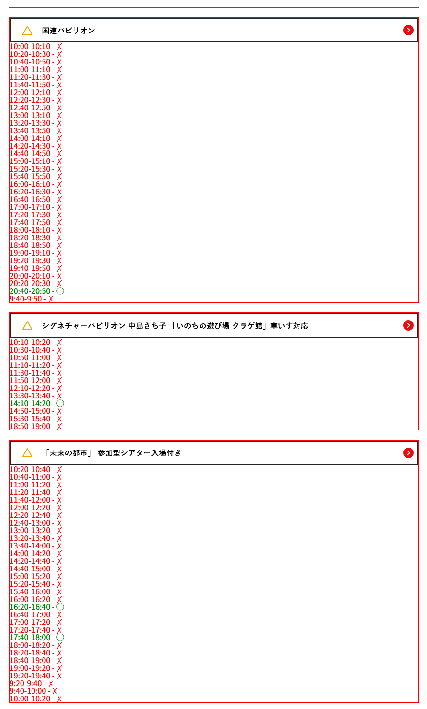

# 万博 Utils

大阪・関西万博のチケット検索サイトを便利にするUserscriptです。

## 機能



- **検索制限の解除**: イベント検索のAPI制限を100件に変更
- **予約状況の可視化**: 各イベントの予約可能状況を色分けで表示
- **不要な情報の非表示**: 不要な注意書きやリンクを非表示
- **自動読み込み**: 「もっと見る」ボタンを自動クリック
- **予約不可イベントの非表示**: 予約可能な枠がないイベントを自動で非表示

## インストール方法

1. ブラウザにTampermonkeyまたはGreasemonkeyをインストール
2. 以下のリンクをクリックしてスクリプトをインストール

**[📥 インストール (最新版)](https://raw.githubusercontent.com/o-tr/expo-utils/release/expo-utils.user.js)**

または、手動でインストールする場合：

1. [こちら](https://raw.githubusercontent.com/o-tr/expo-utils/release/expo-utils.user.js)から最新の`expo-utils.user.js`をダウンロード
2. Tampermonkeyの管理画面で「新しいスクリプトを作成」
3. ダウンロードしたファイルの内容をコピー&ペースト
4. 保存

## 対象サイト

- https://ticket.expo2025.or.jp/event_search/*

## 開発

### 必要な環境

- Node.js 18以上
- pnpm 8以上

### セットアップ

```bash
# 依存関係のインストール
pnpm install

# 開発用ビルド（ファイル監視）
pnpm run watch

# プロダクションビルド
pnpm run build

# 出力ファイルのクリーンアップ
pnpm run clean
```

### ビルド

TypeScriptで記述されたソースコードは、Rollupを使用してバンドルされます。

- **ソースコード**: `src/main.ts`
- **出力ファイル**: `dist/main.js`

### CI/CD

GitHub Actionsを使用して、masterブランチへのプッシュ時に自動的にビルドとデプロイが実行されます。

- **masterブランチ**: 開発用のソースコード
- **releaseブランチ**: ビルドされたUserscriptファイル（`expo-utils.user.js`）

リリースプロセス：
1. masterブランチにプッシュ
2. GitHub Actionsが自動的にビルドを実行
3. ビルドされたUserscriptがreleaseブランチにコミット
4. raw.githubusercontent.comから直接インストール可能

## 技術スタック

- **TypeScript**: 型安全な開発
- **Rollup**: モジュールバンドラー
- **pnpm**: パッケージマネージャー
- **GitHub Actions**: CI/CD

## ライセンス

ISC License

## 免責事項

このUserscriptは個人利用を目的としており、万博公式サイトの利用規約に従って使用してください。